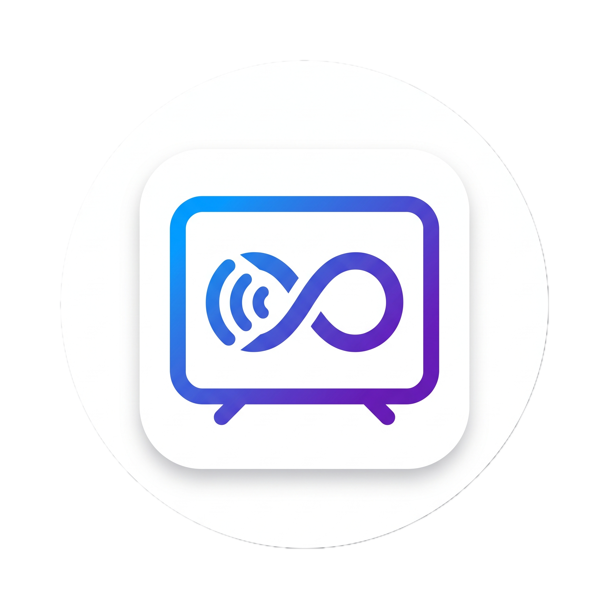

# OmniCast Releases & Downloads

**Stream Any Web Video Straight to Android TV with Zero Limits**

---

## 📥 Direct Downloads

| Version | Package | Target | Download Link |
| :--- | :--- | :--- | :--- |
| **v1.0.0** | Universal APK | Android 5.0 - 15 (ARM64, ARMv7, x86_64) | [**Download OmniCast-v1.0.0.apk**](https://github.com/Alok20507/OmniCast-Releases/releases/download/v1.0.0/OmniCast-v1.0.0.apk) |

---

## ✨ Highlights

- **🛡️ 403 Forbidden CDN Bypass**: Solves anti-hotlinking protections (Referer/Origin headers) on streaming sites (like CineVibe) and VDH-extracted links.
- **📺 Direct ADB Android TV Playback**: Connects directly to VLC on your Android TV over local Wi-Fi with zero AirPlay or DLNA pairing headaches.
- **▶️ Instant YouTube Sharing**: Share YouTube videos directly to OmniCast to launch them on your TV instantly.
- **🔍 Intelligent Stream Sniffer**: Automatically detects and extracts HLS (.m3u8), MP4, and chunked streams as you browse.
- **🍎 Apple HIG Dark Aesthetic**: Native SF Pro typography, dark mode glassmorphism, and unified bottom sheets.
- **🚀 In-App Auto Updates**: Receives update notifications automatically from this repository with one-tap installation.

---

## 📲 How to Install

1. Download **`OmniCast-v1.0.0.apk`** to your Android phone or tablet.
2. Tap the downloaded APK in your notification drawer or Files app.
3. If prompted, toggle **"Allow from this source"** for your browser/file manager.
4. Tap **Install** and open **OmniCast**!

---

## 🌐 Web Download Page
You can enable **GitHub Pages** in this repository's settings (`Settings -> Pages -> Deploy from branch main -> / (root)`) to have a live landing page for sharing with friends!
